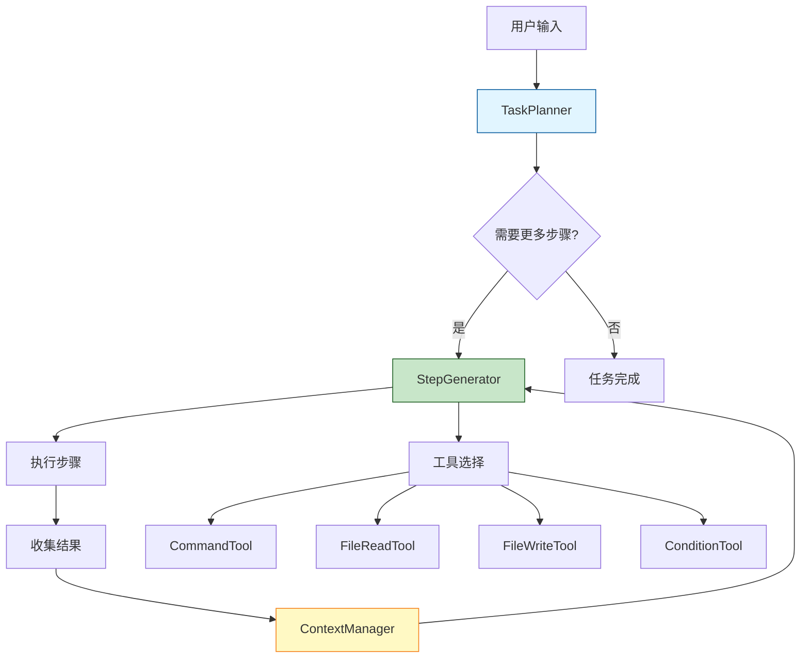
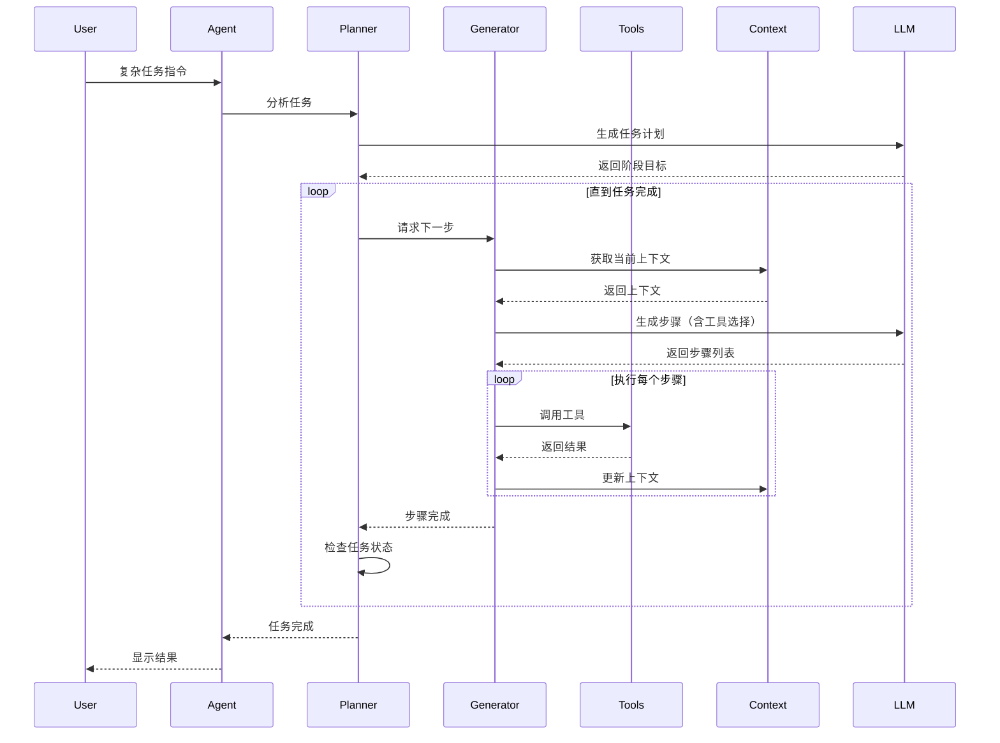

# AutoShell 自适应执行设计文档

## 概述

本文档描述了为 AutoShell 添加**自适应执行能力**的设计方案，使 AI 能够根据上一步的输出动态生成下一步命令，实现复杂任务的智能执行。

## 需求分析

### 用户需求示例

```bash
python main.py --ssh-host vub -c "执行用户目录下的test目录下 a.sh,如果输出为1那修改脚本让它输出为2"
```

### 核心需求拆解

1. **执行脚本并获取输出**：`~/test/a.sh`
2. **条件判断**：检查输出是否为 "1"
3. **文件读取**：读取 `a.sh` 的内容
4. **内容分析**：理解脚本逻辑
5. **文件修改**：修改脚本使其输出 "2"
6. **验证执行**：再次运行脚本验证修改

### 技术挑战

- ❌ **当前架构限制**：LLM 一次性生成所有步骤，无法根据中间结果调整
- ❌ **无文件操作能力**：执行器只能执行命令，不能直接读写文件
- ❌ **无反馈循环**：执行结果不会反馈给 LLM 用于决策
- ❌ **无条件分支**：无法根据输出结果选择不同的执行路径

## 架构设计

### 设计原则

1. **渐进式执行**：每次只生成和执行一个或少量步骤
2. **反馈驱动**：将执行结果反馈给 LLM，指导下一步决策
3. **工具增强**：为 LLM 提供文件操作、条件判断等工具
4. **状态管理**：维护执行上下文和历史记录

### 核心组件



### 新增模块

#### 1. TaskPlanner（任务规划器）

**职责**：
- 分析用户意图
- 将复杂任务分解为阶段
- 决定何时需要生成新步骤

**接口**：
```python
class TaskPlanner:
    def __init__(self, llm_client: LLMClient):
        self.llm = llm_client
        self.task_goal = None
        self.completed_steps = []
        self.current_context = {}
    
    def analyze_task(self, user_query: str) -> Dict:
        """分析任务，返回初始计划"""
        pass
    
    def should_continue(self) -> bool:
        """判断任务是否需要继续"""
        pass
    
    def get_next_phase(self) -> str:
        """获取下一阶段的目标"""
        pass
```

#### 2. StepGenerator（步骤生成器）

**职责**：
- 根据当前上下文生成下一步操作
- 选择合适的工具
- 处理条件分支

**接口**：
```python
class StepGenerator:
    def __init__(self, llm_client: LLMClient):
        self.llm = llm_client
        self.available_tools = [
            CommandTool,
            FileReadTool,
            FileWriteTool,
            ConditionTool
        ]
    
    def generate_next_steps(
        self, 
        goal: str, 
        context: Dict,
        max_steps: int = 3
    ) -> List[Step]:
        """生成接下来的1-3个步骤"""
        pass
```

#### 3. ExecutionContext（执行上下文）

**职责**：
- 维护执行历史
- 存储中间结果
- 提供上下文查询

**接口**：
```python
class ExecutionContext:
    def __init__(self):
        self.history = []  # 执行历史
        self.variables = {}  # 变量存储
        self.files_accessed = {}  # 文件访问记录
    
    def add_step_result(self, step: Step, result: Dict):
        """添加步骤执行结果"""
        pass
    
    def get_variable(self, name: str) -> Any:
        """获取变量值"""
        pass
    
    def set_variable(self, name: str, value: Any):
        """设置变量值"""
        pass
    
    def get_context_summary(self) -> str:
        """获取上下文摘要（用于 LLM）"""
        pass
```

#### 4. Tool System（工具系统）

**职责**：
- 提供多种操作工具
- 统一工具接口
- 工具执行和结果处理

**工具类型**：

##### CommandTool（命令工具）
```python
class CommandTool(BaseTool):
    name = "execute_command"
    description = "Execute a shell command"
    
    def execute(self, command: str, cwd: str = None) -> Dict:
        """执行命令并返回结果"""
        pass
```

##### FileReadTool（文件读取工具）
```python
class FileReadTool(BaseTool):
    name = "read_file"
    description = "Read content from a file"
    
    def execute(self, file_path: str, encoding: str = "utf-8") -> Dict:
        """读取文件内容"""
        pass
```

##### FileWriteTool（文件写入工具）
```python
class FileWriteTool(BaseTool):
    name = "write_file"
    description = "Write content to a file"
    
    def execute(
        self, 
        file_path: str, 
        content: str,
        mode: str = "w",  # w: 覆盖, a: 追加
        encoding: str = "utf-8"
    ) -> Dict:
        """写入文件内容"""
        pass
```

##### FileEditTool（文件编辑工具）
```python
class FileEditTool(BaseTool):
    name = "edit_file"
    description = "Edit file using search and replace"
    
    def execute(
        self,
        file_path: str,
        search_pattern: str,
        replacement: str,
        regex: bool = False
    ) -> Dict:
        """搜索并替换文件内容"""
        pass
```

##### ConditionTool（条件判断工具）
```python
class ConditionTool(BaseTool):
    name = "check_condition"
    description = "Evaluate a condition based on context"
    
    def execute(
        self,
        condition: str,  # 例如: "output == '1'"
        context: Dict
    ) -> Dict:
        """评估条件"""
        pass
```

## 执行流程

### 整体流程



### 示例执行流程

**任务**：执行 `~/test/a.sh`，如果输出为1则修改脚本让它输出2

#### 阶段 1：初始分析

**LLM 输入**：
```
用户任务：执行用户目录下的test目录下 a.sh,如果输出为1那修改脚本让它输出为2

请分析这个任务并生成初始计划。
```

**LLM 输出**：
```json
{
  "task_type": "conditional_script_modification",
  "phases": [
    {
      "phase": 1,
      "goal": "执行脚本并获取输出",
      "description": "运行 ~/test/a.sh 并记录输出"
    },
    {
      "phase": 2,
      "goal": "条件判断和文件修改",
      "description": "如果输出为1，读取并修改脚本"
    },
    {
      "phase": 3,
      "goal": "验证修改",
      "description": "重新执行脚本验证输出为2"
    }
  ]
}
```

#### 阶段 1：执行脚本

**LLM 输入**：
```
当前阶段目标：执行脚本并获取输出
执行环境：SSH - user@remote-host
当前目录：/home/user
已完成步骤：无

请生成接下来的步骤（使用可用工具）。

可用工具：
- execute_command: 执行shell命令
- read_file: 读取文件内容
- write_file: 写入文件内容
- edit_file: 编辑文件内容
- check_condition: 条件判断
```

**LLM 输出**：
```json
{
  "steps": [
    {
      "tool": "execute_command",
      "description": "执行 a.sh 脚本",
      "parameters": {
        "command": "bash ~/test/a.sh",
        "cwd": null
      },
      "save_output_as": "script_output"
    }
  ]
}
```

**执行结果**：
```json
{
  "return_code": 0,
  "stdout": "1\n",
  "stderr": ""
}
```

**上下文更新**：
```python
context.set_variable("script_output", "1")
context.add_step_result(step, result)
```

#### 阶段 2：条件判断和修改

**LLM 输入**：
```
当前阶段目标：条件判断和文件修改
执行环境：SSH - user@remote-host
当前目录：/home/user

已完成步骤：
1. 执行 bash ~/test/a.sh
   - 输出：1
   - 状态：成功

上下文变量：
- script_output = "1"

请生成接下来的步骤。
```

**LLM 输出**：
```json
{
  "steps": [
    {
      "tool": "check_condition",
      "description": "检查脚本输出是否为1",
      "parameters": {
        "condition": "script_output.strip() == '1'",
        "context": {"script_output": "1"}
      },
      "save_output_as": "condition_result"
    },
    {
      "tool": "read_file",
      "description": "读取脚本内容",
      "parameters": {
        "file_path": "~/test/a.sh"
      },
      "save_output_as": "script_content",
      "condition": "condition_result == True"
    },
    {
      "tool": "edit_file",
      "description": "修改脚本输出为2",
      "parameters": {
        "file_path": "~/test/a.sh",
        "search_pattern": "echo 1",
        "replacement": "echo 2",
        "regex": false
      },
      "condition": "condition_result == True"
    }
  ]
}
```

**执行结果**：
- 条件判断：True
- 文件读取：成功
- 文件修改：成功

#### 阶段 3：验证

**LLM 输入**：
```
当前阶段目标：验证修改
执行环境：SSH - user@remote-host

已完成步骤：
1. 执行 bash ~/test/a.sh -> 输出：1
2. 条件判断 -> True
3. 读取文件 ~/test/a.sh
4. 修改文件 ~/test/a.sh (echo 1 -> echo 2)

请生成验证步骤。
```

**LLM 输出**：
```json
{
  "steps": [
    {
      "tool": "execute_command",
      "description": "重新执行脚本验证修改",
      "parameters": {
        "command": "bash ~/test/a.sh"
      },
      "save_output_as": "new_output"
    },
    {
      "tool": "check_condition",
      "description": "验证输出是否为2",
      "parameters": {
        "condition": "new_output.strip() == '2'",
        "context": {"new_output": "2"}
      }
    }
  ]
}
```

**执行结果**：
- 脚本输出：2
- 验证成功

**任务完成**！

## LLM Prompt 设计

### System Prompt（工具模式）

```
You are an intelligent task execution assistant with access to various tools.

Your goal is to help users accomplish complex tasks by:
1. Breaking down tasks into manageable steps
2. Selecting appropriate tools for each step
3. Adapting your plan based on execution results
4. Handling conditional logic and error cases

Available Tools:
- execute_command: Execute shell commands
- read_file: Read file contents
- write_file: Write content to files
- edit_file: Search and replace in files
- check_condition: Evaluate conditions

Execution Environment:
{execution_context}

Current Task Phase:
{current_phase}

Execution History:
{execution_history}

Context Variables:
{context_variables}

Instructions:
1. Generate 1-3 steps for the current phase
2. Each step must specify:
   - tool: Tool name to use
   - description: What this step does
   - parameters: Tool-specific parameters
   - save_output_as: (optional) Variable name to store result
   - condition: (optional) Condition to execute this step
3. Consider the execution history and context
4. Handle errors gracefully
5. Provide clear descriptions

Response Format (JSON):
{
  "reasoning": "Your thought process",
  "steps": [
    {
      "tool": "tool_name",
      "description": "Step description",
      "parameters": {...},
      "save_output_as": "variable_name",
      "condition": "optional_condition"
    }
  ],
  "expected_outcome": "What should happen after these steps"
}
```

### Task Planning Prompt

```
Analyze the following user task and create a high-level execution plan.

User Task: {user_query}

Execution Environment: {context}

Break down the task into phases. Each phase should have:
- A clear goal
- Expected inputs/outputs
- Success criteria

Response Format (JSON):
{
  "task_type": "task_category",
  "complexity": "simple|medium|complex",
  "phases": [
    {
      "phase": 1,
      "goal": "Phase goal",
      "description": "Detailed description",
      "dependencies": ["previous_phase_outputs"],
      "success_criteria": "How to know this phase succeeded"
    }
  ],
  "estimated_steps": "approximate_number",
  "potential_challenges": ["challenge1", "challenge2"]
}
```

## 数据结构

### Step（步骤）

```python
@dataclass
class Step:
    tool: str
    description: str
    parameters: Dict[str, Any]
    save_output_as: Optional[str] = None
    condition: Optional[str] = None
    
    def should_execute(self, context: ExecutionContext) -> bool:
        """判断是否应该执行此步骤"""
        if not self.condition:
            return True
        return context.evaluate_condition(self.condition)
```

### StepResult（步骤结果）

```python
@dataclass
class StepResult:
    step: Step
    success: bool
    output: Any
    error: Optional[str] = None
    execution_time: float = 0.0
    
    def to_dict(self) -> Dict:
        """转换为字典（用于上下文）"""
        return {
            "tool": self.step.tool,
            "description": self.step.description,
            "success": self.success,
            "output": self.output,
            "error": self.error
        }
```

### TaskPhase（任务阶段）

```python
@dataclass
class TaskPhase:
    phase: int
    goal: str
    description: str
    dependencies: List[str]
    success_criteria: str
    completed: bool = False
    steps_executed: List[StepResult] = field(default_factory=list)
```

## 安全考虑

### 文件操作安全

1. **路径验证**：
   - 禁止访问系统关键目录（/etc, /sys, /proc等）
   - 限制在用户目录或指定工作目录内
   - 检测路径遍历攻击（../）

2. **文件大小限制**：
   - 读取文件大小限制（默认10MB）
   - 写入文件大小限制
   - 防止磁盘空间耗尽

3. **文件类型检查**：
   - 限制可操作的文件类型
   - 禁止操作二进制可执行文件
   - 检查文件权限

### 命令执行安全

1. **保持现有白名单机制**
2. **工具调用审计**：记录所有工具调用
3. **用户确认**：危险操作需要用户确认

### 代码示例

```python
class FileOperationSafety:
    FORBIDDEN_PATHS = [
        "/etc", "/sys", "/proc", "/dev",
        "/boot", "/root", "C:\\Windows", "C:\\System32"
    ]
    
    MAX_FILE_SIZE = 10 * 1024 * 1024  # 10MB
    
    ALLOWED_EXTENSIONS = [
        ".sh", ".py", ".js", ".txt", ".md",
        ".json", ".yaml", ".yml", ".conf", ".cfg"
    ]
    
    @classmethod
    def validate_path(cls, file_path: str, base_dir: str) -> bool:
        """验证文件路径安全性"""
        # 解析绝对路径
        abs_path = os.path.abspath(os.path.expanduser(file_path))
        
        # 检查是否在允许的基础目录内
        if not abs_path.startswith(base_dir):
            return False
        
        # 检查是否访问禁止目录
        for forbidden in cls.FORBIDDEN_PATHS:
            if abs_path.startswith(forbidden):
                return False
        
        # 检查路径遍历
        if ".." in file_path:
            return False
        
        return True
    
    @classmethod
    def validate_file_size(cls, file_path: str) -> bool:
        """验证文件大小"""
        if os.path.exists(file_path):
            size = os.path.getsize(file_path)
            return size <= cls.MAX_FILE_SIZE
        return True
    
    @classmethod
    def validate_file_type(cls, file_path: str) -> bool:
        """验证文件类型"""
        ext = os.path.splitext(file_path)[1].lower()
        return ext in cls.ALLOWED_EXTENSIONS
```

## 实现计划

### 阶段 1：核心框架（3-4天）

- [ ] 创建 `ExecutionContext` 类
- [ ] 创建 `TaskPlanner` 类
- [ ] 创建 `StepGenerator` 类
- [ ] 实现基础工具系统框架
- [ ] 修改 `AutoShellAgent` 集成新组件

### 阶段 2：工具实现（3-4天）

- [ ] 实现 `CommandTool`（复用现有执行器）
- [ ] 实现 `FileReadTool`
- [ ] 实现 `FileWriteTool`
- [ ] 实现 `FileEditTool`
- [ ] 实现 `ConditionTool`
- [ ] 添加安全检查机制

### 阶段 3：LLM 集成（2-3天）

- [ ] 设计工具模式 Prompt
- [ ] 实现任务规划 Prompt
- [ ] 实现步骤生成 Prompt
- [ ] 添加上下文摘要生成
- [ ] 优化 JSON 解析

### 阶段 4：执行流程（2-3天）

- [ ] 实现渐进式执行循环
- [ ] 实现条件判断逻辑
- [ ] 实现错误处理和重试
- [ ] 添加执行历史记录
- [ ] 实现任务状态管理

### 阶段 5：测试和优化（3-4天）

- [ ] 单元测试（各工具）
- [ ] 集成测试（完整流程）
- [ ] 复杂场景测试
- [ ] 性能优化
- [ ] 文档编写

**总计**：13-18天

## 目录结构

```
AutoShell/
├── autoshell/
│   ├── agent.py              # 修改：集成新执行模式
│   ├── executor.py           # 保持：命令执行
│   ├── llm.py                # 修改：添加工具模式
│   ├── config.py             # 修改：添加新配置
│   ├── context.py            # 保持：环境上下文
│   │
│   ├── adaptive/             # 新增：自适应执行模块
│   │   ├── __init__.py
│   │   ├── planner.py        # TaskPlanner
│   │   ├── generator.py      # StepGenerator
│   │   ├── context.py        # ExecutionContext
│   │   └── models.py         # 数据模型
│   │
│   └── tools/                # 新增：工具系统
│       ├── __init__.py
│       ├── base.py           # BaseTool
│       ├── command.py        # CommandTool
│       ├── file_read.py      # FileReadTool
│       ├── file_write.py     # FileWriteTool
│       ├── file_edit.py      # FileEditTool
│       ├── condition.py      # ConditionTool
│       └── safety.py         # 安全检查
│
├── plans/
│   └── adaptive-execution-design.md  # 本文档
│
└── tests/                    # 新增：测试
    ├── test_tools.py
    ├── test_planner.py
    ├── test_generator.py
    └── test_integration.py
```

## 配置扩展

### .env 新增配置

```bash
# 自适应执行配置
ADAPTIVE_MODE=true                    # 启用自适应执行
MAX_EXECUTION_STEPS=50                # 最大执行步骤数
STEP_GENERATION_BATCH=3               # 每次生成步骤数
ENABLE_FILE_OPERATIONS=true           # 启用文件操作
FILE_OPERATION_BASE_DIR=~             # 文件操作基础目录
MAX_FILE_SIZE_MB=10                   # 最大文件大小（MB）

# 安全配置
REQUIRE_CONFIRMATION_FOR_FILE_WRITE=true  # 文件写入需要确认
REQUIRE_CONFIRMATION_FOR_FILE_DELETE=true # 文件删除需要确认
```

## 使用示例

### 示例 1：条件脚本修改

```bash
python main.py --ssh-host vub -c "执行用户目录下的test目录下 a.sh,如果输出为1那修改脚本让它输出为2"
```

**执行过程**：
1. 执行 `~/test/a.sh`
2. 检查输出是否为 "1"
3. 读取 `a.sh` 内容
4. 修改脚本（echo 1 -> echo 2）
5. 重新执行验证

### 示例 2：日志分析和处理

```bash
python main.py -c "检查 /var/log/app.log 中的错误，如果有ERROR级别的日志，提取错误信息并保存到 errors.txt"
```

**执行过程**：
1. 读取 `/var/log/app.log`
2. 搜索 ERROR 关键字
3. 提取错误行
4. 写入 `errors.txt`

### 示例 3：配置文件更新

```bash
python main.py -c "读取 config.json，如果 debug 为 false，改为 true 并重启服务"
```

**执行过程**：
1. 读取 `config.json`
2. 解析 JSON
3. 检查 debug 字段
4. 修改配置文件
5. 执行重启命令

## 优势分析

### 相比当前架构

| 特性 | 当前架构 | 自适应架构 |
|------|----------|------------|
| 执行方式 | 一次性生成所有步骤 | 渐进式生成和执行 |
| 反馈循环 | 无 | 有（每步反馈） |
| 条件判断 | 不支持 | 支持 |
| 文件操作 | 仅通过命令 | 直接文件操作 |
| 错误恢复 | 重新生成整个计划 | 局部调整 |
| 复杂任务 | 受限 | 强大 |

### 技术优势

1. **智能决策**：根据实际执行结果动态调整
2. **灵活性**：支持复杂的条件逻辑
3. **可扩展**：工具系统易于扩展
4. **安全性**：细粒度的安全控制
5. **可观测**：完整的执行历史

## 风险和挑战

### 技术风险

1. **LLM 调用次数增加**
   - **影响**：成本增加，延迟增加
   - **缓解**：批量生成步骤，缓存策略

2. **复杂度增加**
   - **影响**：代码维护难度
   - **缓解**：清晰的模块划分，完善的测试

3. **文件操作风险**
   - **影响**：可能误操作重要文件
   - **缓解**：严格的安全检查，用户确认

### 性能考虑

- **LLM 调用优化**：批量生成多个步骤
- **上下文压缩**：只传递关键信息给 LLM
- **缓存机制**：缓存文件内容，避免重复读取

## 后续增强

### 短期（1-2个月）

- 添加更多工具（网络请求、数据库操作）
- 实现工具组合（复合工具）
- 添加执行可视化
- 支持任务暂停和恢复

### 中期（3-6个月）

- 实现工具学习（从历史中学习）
- 支持并行执行
- 添加工具市场（用户自定义工具）
- 实现任务模板

### 长期（6-12个月）

- 多 Agent 协作
- 自然语言编程
- 可视化工作流编辑器
- 云端任务调度

## 总结

本设计方案通过引入**自适应执行架构**，使 AutoShell 能够：

✅ 根据执行结果动态调整策略
✅ 支持复杂的条件逻辑和文件操作
✅ 提供强大的工具系统
✅ 保持良好的安全性和可扩展性

这将使 AutoShell 从一个"命令翻译器"进化为一个真正的"智能任务执行助手"。

---

**文档版本**：v1.0
**创建日期**：2026-01-21
**状态**：设计阶段
