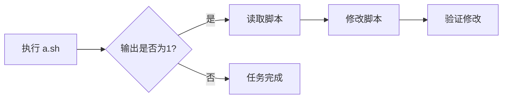
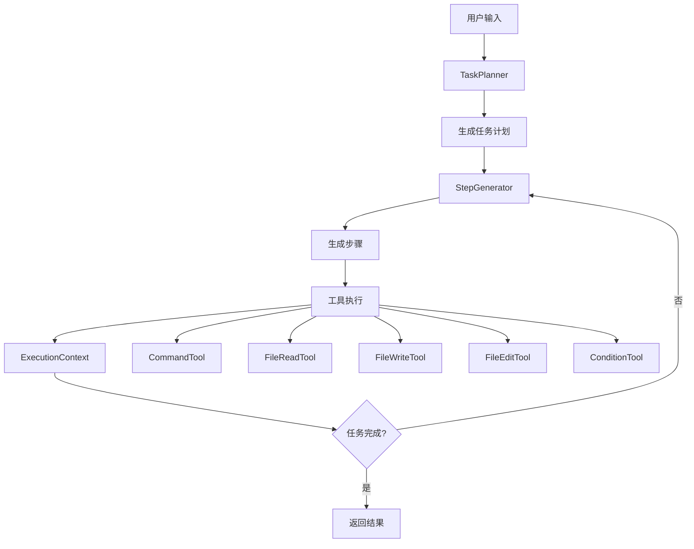

# AutoShell 自适应执行快速入门

## 概述

自适应执行模式使 AutoShell 能够根据执行结果动态调整策略，处理复杂的多步骤任务。

## 核心特性

✅ **渐进式执行**：每次生成少量步骤，根据结果调整
✅ **文件操作**：直接读取、写入、编辑文件
✅ **条件判断**：根据输出结果选择不同路径
✅ **上下文管理**：维护执行历史和变量
✅ **工具系统**：可扩展的工具架构

## 快速开始

### 1. 配置环境

在 [`.env`](.env:1) 文件中添加：

```bash
# 启用自适应执行
ADAPTIVE_MODE=true

# 执行配置
MAX_EXECUTION_STEPS=50
STEP_GENERATION_BATCH=3

# 文件操作配置
ENABLE_FILE_OPERATIONS=true
FILE_OPERATION_BASE_DIR=~
MAX_FILE_SIZE_MB=10
```

### 2. 基本使用

```bash
# 本地模式
python main.py -c "执行 test.sh，如果输出为1则修改为2"

# SSH 模式
python main.py --ssh-host user@host -c "检查日志文件，提取错误信息"
```

## 使用示例

### 示例 1：条件脚本修改

**任务**：执行脚本，根据输出修改脚本内容

```bash
python main.py --ssh-host vub -c "执行用户目录下的test目录下 a.sh,如果输出为1那修改脚本让它输出为2"
```

**执行流程**：



**详细步骤**：
1. 执行 `bash ~/test/a.sh`
2. 检查输出是否为 "1"
3. 读取 `~/test/a.sh` 内容
4. 搜索并替换 `echo 1` 为 `echo 2`
5. 重新执行脚本验证

### 示例 2：日志分析

**任务**：分析日志文件，提取错误信息

```bash
python main.py -c "检查 /var/log/app.log 中的错误，如果有ERROR级别的日志，提取错误信息并保存到 errors.txt"
```

**执行流程**：
1. 读取 `/var/log/app.log`
2. 搜索包含 "ERROR" 的行
3. 提取错误信息
4. 写入 `errors.txt`

### 示例 3：配置文件更新

**任务**：修改配置文件并重启服务

```bash
python main.py -c "读取 config.json，如果 debug 为 false，改为 true 并重启服务"
```

**执行流程**：
1. 读取 `config.json`
2. 检查 `debug` 字段值
3. 如果为 `false`，修改为 `true`
4. 执行服务重启命令

## 可用工具

### 1. execute_command

执行 shell 命令

**参数**：
- `command` (必需): 要执行的命令
- `cwd` (可选): 工作目录

**示例**：
```json
{
  "tool": "execute_command",
  "parameters": {
    "command": "ls -la",
    "cwd": "/home/user"
  }
}
```

### 2. read_file

读取文件内容

**参数**：
- `file_path` (必需): 文件路径
- `encoding` (可选): 编码，默认 utf-8
- `max_lines` (可选): 最大读取行数

**示例**：
```json
{
  "tool": "read_file",
  "parameters": {
    "file_path": "~/test/script.sh",
    "max_lines": 100
  }
}
```

### 3. write_file

写入文件内容

**参数**：
- `file_path` (必需): 文件路径
- `content` (必需): 要写入的内容
- `mode` (可选): 写入模式，w=覆盖，a=追加
- `encoding` (可选): 编码，默认 utf-8

**示例**：
```json
{
  "tool": "write_file",
  "parameters": {
    "file_path": "output.txt",
    "content": "Hello World",
    "mode": "w"
  }
}
```

### 4. edit_file

编辑文件（搜索替换）

**参数**：
- `file_path` (必需): 文件路径
- `search_pattern` (必需): 搜索模式
- `replacement` (必需): 替换内容
- `regex` (可选): 是否使用正则表达式
- `count` (可选): 替换次数，-1=全部

**示例**：
```json
{
  "tool": "edit_file",
  "parameters": {
    "file_path": "script.sh",
    "search_pattern": "echo 1",
    "replacement": "echo 2",
    "regex": false
  }
}
```

### 5. check_condition

条件判断

**参数**：
- `condition` (必需): 条件表达式
- `context` (必需): 上下文变量

**示例**：
```json
{
  "tool": "check_condition",
  "parameters": {
    "condition": "output.strip() == '1'",
    "context": {"output": "1"}
  }
}
```

## 架构概览



## 核心组件

### TaskPlanner（任务规划器）

- 分析用户任务
- 生成执行阶段
- 管理任务进度

### StepGenerator（步骤生成器）

- 根据当前阶段生成步骤
- 选择合适的工具
- 处理条件分支

### ExecutionContext（执行上下文）

- 维护执行历史
- 存储变量
- 提供上下文查询

### Tool System（工具系统）

- 命令执行
- 文件操作
- 条件判断

## 安全机制

### 文件操作安全

1. **路径限制**：
   - 限制在 `FILE_OPERATION_BASE_DIR` 内
   - 禁止访问系统目录（/etc, /sys等）
   - 检测路径遍历攻击

2. **文件大小限制**：
   - 默认最大 10MB
   - 可通过 `MAX_FILE_SIZE_MB` 配置

3. **文件类型限制**：
   - 仅允许文本文件
   - 禁止操作二进制可执行文件

### 命令执行安全

- 保持现有白名单机制
- 危险操作需要用户确认
- 记录所有操作日志

## 配置参数

| 参数 | 说明 | 默认值 |
|------|------|--------|
| `ADAPTIVE_MODE` | 启用自适应执行 | false |
| `MAX_EXECUTION_STEPS` | 最大执行步骤数 | 50 |
| `STEP_GENERATION_BATCH` | 每次生成步骤数 | 3 |
| `ENABLE_FILE_OPERATIONS` | 启用文件操作 | true |
| `FILE_OPERATION_BASE_DIR` | 文件操作基础目录 | ~ |
| `MAX_FILE_SIZE_MB` | 最大文件大小（MB） | 10 |

## 执行流程

### 1. 任务分析

```
用户输入 → TaskPlanner → 生成任务计划
```

任务计划包含多个阶段，每个阶段有明确的目标。

### 2. 步骤生成

```
当前阶段 + 执行上下文 → StepGenerator → 生成1-3个步骤
```

根据当前状态动态生成下一步操作。

### 3. 工具执行

```
步骤 → 选择工具 → 执行 → 更新上下文
```

执行工具并将结果保存到上下文。

### 4. 反馈循环

```
执行结果 → 更新上下文 → 生成新步骤
```

根据执行结果调整后续步骤。

## 与传统模式对比

| 特性 | 传统模式 | 自适应模式 |
|------|----------|------------|
| 执行方式 | 一次性生成所有步骤 | 渐进式生成和执行 |
| 反馈循环 | 无 | 有 |
| 条件判断 | 不支持 | 支持 |
| 文件操作 | 仅通过命令 | 直接操作 |
| 错误恢复 | 重新生成整个计划 | 局部调整 |
| 适用场景 | 简单任务 | 复杂任务 |

## 最佳实践

### 1. 任务描述

**好的描述**：
```
执行 test.sh，如果输出为1则修改脚本让它输出为2，然后验证修改
```

**不好的描述**：
```
处理 test.sh
```

### 2. 文件路径

使用绝对路径或相对于家目录的路径：
```bash
# 推荐
~/test/script.sh
/home/user/test/script.sh

# 不推荐
../../../etc/passwd  # 会被安全检查拒绝
```

### 3. 条件表达式

使用简单明确的条件：
```python
# 推荐
output.strip() == "1"
len(errors) > 0

# 不推荐
complex_function(output) and some_other_check()
```

## 故障排查

### 问题 1：文件操作被拒绝

**原因**：文件路径超出允许范围

**解决**：
1. 检查 `FILE_OPERATION_BASE_DIR` 配置
2. 确保文件在允许的目录内
3. 检查文件类型是否被允许

### 问题 2：步骤生成失败

**原因**：LLM 返回格式错误

**解决**：
1. 检查 LLM 配置
2. 查看详细错误日志
3. 简化任务描述

### 问题 3：条件判断不生效

**原因**：条件表达式错误或变量未定义

**解决**：
1. 检查变量是否正确保存
2. 使用简单的条件表达式
3. 查看执行上下文

## 性能优化

### 1. 批量生成步骤

增加 `STEP_GENERATION_BATCH` 减少 LLM 调用次数：
```bash
STEP_GENERATION_BATCH=5  # 每次生成5个步骤
```

### 2. 限制历史长度

执行上下文默认保留最近 20 步，可以调整：
```python
context.max_history_length = 10  # 减少内存占用
```

### 3. 文件大小限制

对大文件使用 `max_lines` 参数：
```json
{
  "tool": "read_file",
  "parameters": {
    "file_path": "large.log",
    "max_lines": 100
  }
}
```

## 扩展开发

### 添加自定义工具

1. 创建工具类：

```python
from autoshell.tools.base import BaseTool, ToolResult

class MyCustomTool(BaseTool):
    name = "my_tool"
    description = "My custom tool"
    
    def execute(self, **kwargs) -> ToolResult:
        # 实现工具逻辑
        return ToolResult(success=True, output="result")
    
    def validate_parameters(self, **kwargs) -> bool:
        # 验证参数
        return True
    
    def _get_parameters_schema(self) -> Dict:
        # 返回参数模式
        return {}
```

2. 注册工具：

```python
# 在 agent.py 的 run_adaptive 方法中
tools["my_tool"] = MyCustomTool()
```

## 相关文档

- [设计文档](adaptive-execution-design.md) - 完整架构设计
- [实现指南](adaptive-execution-implementation.md) - 详细实现步骤
- [SSH 使用指南](../SSH_USAGE.md) - SSH 模式配置

## 常见问题

### Q: 自适应模式和传统模式有什么区别？

A: 自适应模式能够根据执行结果动态调整策略，支持条件判断和文件操作，适合复杂任务。传统模式一次性生成所有步骤，适合简单任务。

### Q: 如何启用自适应模式？

A: 在 `.env` 文件中设置 `ADAPTIVE_MODE=true`。

### Q: 文件操作有哪些限制？

A: 
- 路径限制在 `FILE_OPERATION_BASE_DIR` 内
- 文件大小不超过 `MAX_FILE_SIZE_MB`
- 仅允许特定类型的文本文件
- 禁止访问系统关键目录

### Q: 如何调试执行过程？

A: 查看控制台输出，包含：
- 任务计划
- 每个步骤的执行结果
- 上下文变量
- 错误信息

### Q: 性能如何优化？

A: 
- 增加 `STEP_GENERATION_BATCH` 减少 LLM 调用
- 使用 `max_lines` 限制文件读取
- 简化任务描述
- 使用缓存机制

## 更新日志

### v1.0.0 (2026-01-21)

- 初始版本
- 支持渐进式执行
- 实现工具系统
- 添加文件操作能力
- 实现条件判断

---

**文档版本**：v1.0
**最后更新**：2026-01-21
