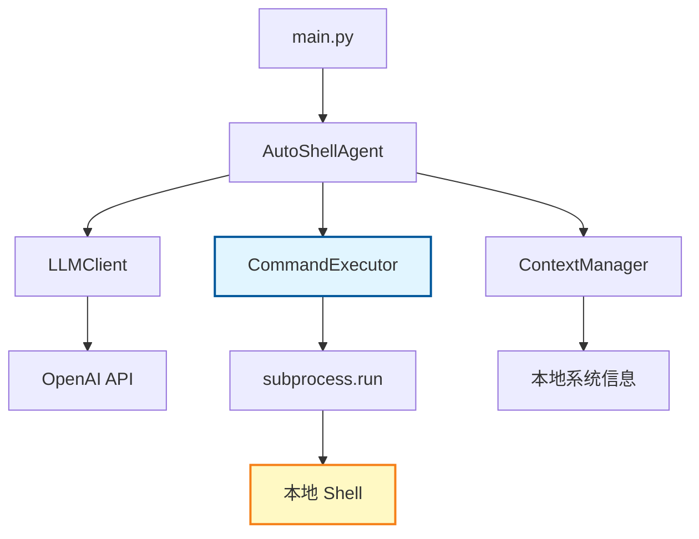
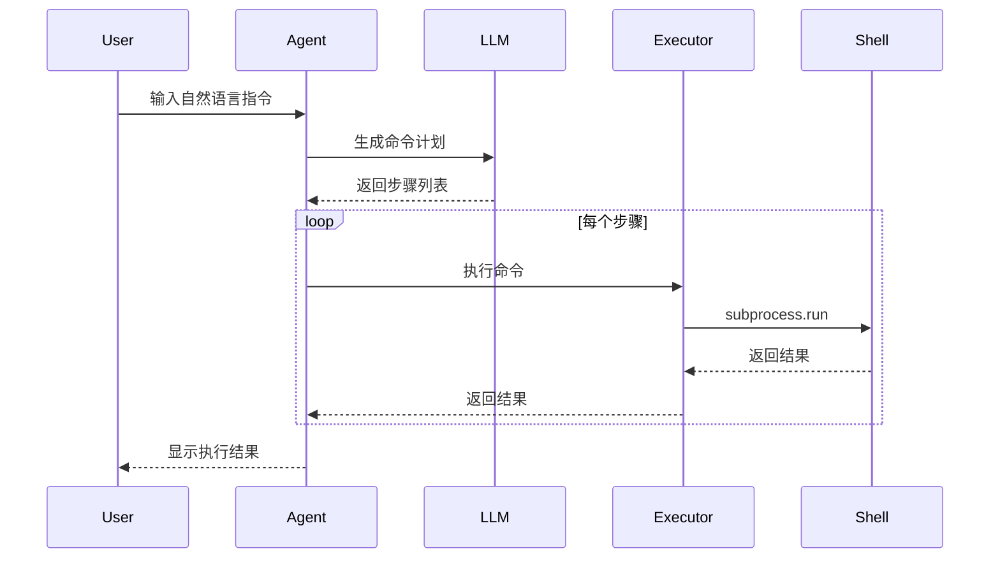
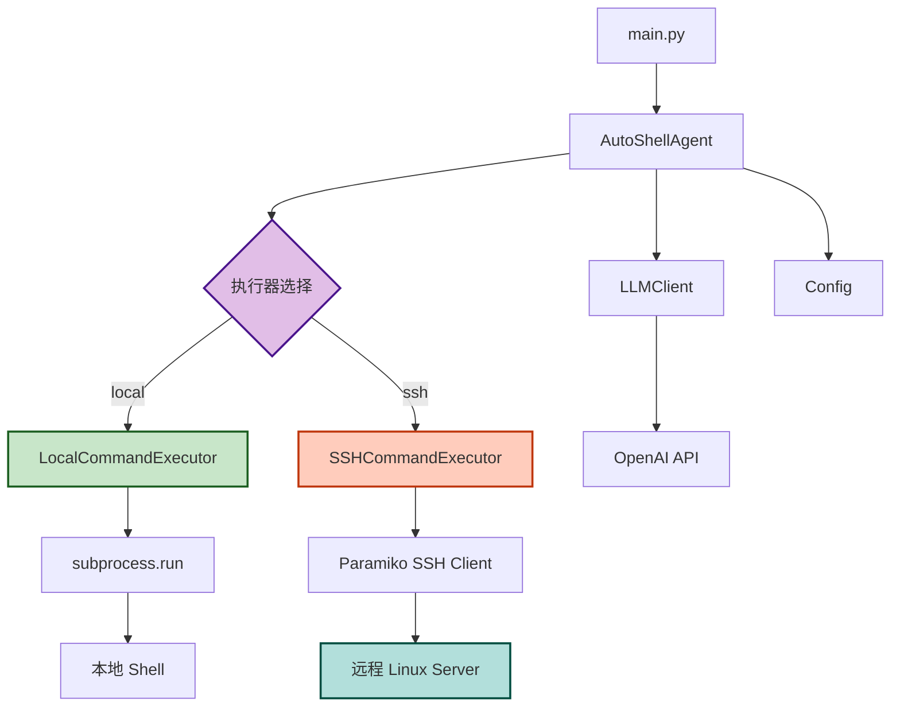
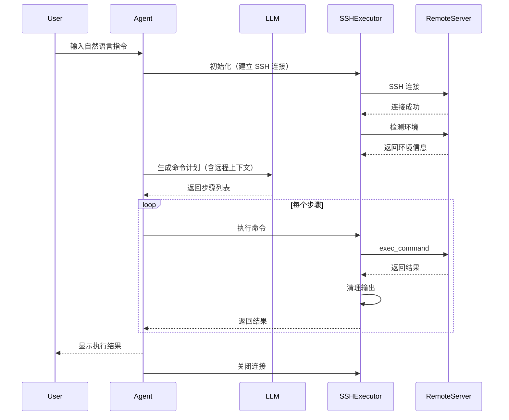

# AutoShell 架构对比：本地执行 vs SSH 远程执行

## 架构演进概览

本文档对比了 AutoShell 在添加 SSH 远程执行功能前后的架构变化。

## 原始架构（v1.0.0）

### 组件图



### 核心类

| 类名 | 职责 | 文件位置 |
|------|------|----------|
| `AutoShellAgent` | 主控制流，协调各组件 | `autoshell/agent.py` |
| `LLMClient` | 与 LLM API 交互 | `autoshell/llm.py` |
| `CommandExecutor` | 执行本地命令 | `autoshell/executor.py` |
| `ContextManager` | 收集本地环境信息 | `autoshell/context.py` |
| `Config` | 配置管理 | `autoshell/config.py` |

### 执行流程



### 限制

- ✗ 仅支持本地命令执行
- ✗ 无法管理远程服务器
- ✗ 执行器硬编码，无法扩展
- ✗ 上下文仅限本地环境

## 新架构（v1.1.0）

### 组件图



### 核心类

| 类名 | 职责 | 文件位置 |
|------|------|----------|
| `AutoShellAgent` | 主控制流，选择执行器 | `autoshell/agent.py` |
| `LLMClient` | 与 LLM API 交互 | `autoshell/llm.py` |
| `CommandExecutor` | **抽象基类** | `autoshell/executors/base.py` |
| `LocalCommandExecutor` | 本地命令执行 | `autoshell/executors/local.py` |
| `SSHCommandExecutor` | SSH 远程命令执行 | `autoshell/executors/ssh.py` |
| `ContextManager` | 收集环境信息 | `autoshell/context.py` |
| `Config` | 配置管理（含 SSH） | `autoshell/config.py` |

### 执行流程（SSH 模式）



### 新增功能

- ✓ 支持本地和远程执行
- ✓ 执行器抽象，易于扩展
- ✓ SSH 密钥和密码认证
- ✓ 远程环境自动检测
- ✓ 跨平台路径处理
- ✓ 实时输出流式传输
- ✓ 连接健康检查和自动重连

## 详细对比

### 1. 执行器设计

#### 原始设计

```python
# autoshell/executor.py
class CommandExecutor:
    WHITELIST = {...}
    
    @classmethod
    def is_safe(cls, command: str) -> bool:
        # 检查白名单
        pass
    
    @classmethod
    def execute(cls, command: str, cwd: str = None, 
                description: str = None) -> dict:
        # 使用 subprocess.run 执行
        result = subprocess.run(command, shell=True, ...)
        return {...}
```

**特点**：
- 类方法，无状态
- 直接使用 subprocess
- 仅支持本地执行

#### 新设计

```python
# autoshell/executors/base.py
class CommandExecutor(ABC):
    @abstractmethod
    def execute(self, command: str, ...) -> Dict:
        pass
    
    @abstractmethod
    def is_safe(self, command: str) -> bool:
        pass
    
    @abstractmethod
    def close(self):
        pass
    
    @abstractmethod
    def get_context(self) -> Dict:
        pass
```

```python
# autoshell/executors/local.py
class LocalCommandExecutor(CommandExecutor):
    def __init__(self):
        self.os_type = platform.system()
    
    def execute(self, command: str, ...) -> dict:
        result = subprocess.run(...)
        return {...}
    
    def get_context(self) -> dict:
        return {"os": ..., "shell": ..., ...}
```

```python
# autoshell/executors/ssh.py
class SSHCommandExecutor(CommandExecutor):
    def __init__(self, host, port, username, ...):
        self.client = paramiko.SSHClient()
        self._connect()
        self._detect_remote_environment()
    
    def execute(self, command: str, ...) -> dict:
        stdin, stdout, stderr = self.client.exec_command(...)
        return {...}
    
    def get_context(self) -> dict:
        return {"os": self._remote_os, ...}
```

**特点**：
- 面向对象，有状态
- 抽象基类定义接口
- 支持多种执行策略
- 每个执行器管理自己的上下文

### 2. Agent 初始化

#### 原始设计

```python
class AutoShellAgent:
    def __init__(self):
        self.llm = LLMClient()
        self.max_retries = Config.MAX_RETRIES
```

#### 新设计

```python
class AutoShellAgent:
    def __init__(self):
        self.llm = LLMClient()
        self.max_retries = Config.MAX_RETRIES
        
        # 根据配置选择执行器
        if Config.is_ssh_mode():
            self.executor = SSHCommandExecutor(
                host=Config.SSH_HOST,
                port=Config.SSH_PORT,
                username=Config.SSH_USERNAME,
                password=Config.SSH_PASSWORD,
                key_path=Config.SSH_KEY_PATH,
                timeout=Config.SSH_TIMEOUT
            )
        else:
            self.executor = LocalCommandExecutor()
        
        # 获取执行环境上下文
        self.execution_context = self.executor.get_context()
    
    def __del__(self):
        if hasattr(self, 'executor'):
            self.executor.close()
```

**变化**：
- 动态选择执行器
- 管理执行器生命周期
- 获取并缓存执行上下文

### 3. 命令执行

#### 原始设计

```python
# 在 agent.py 中
result = CommandExecutor.execute(command, cwd=session_cwd, 
                                 description=description)
```

#### 新设计

```python
# 在 agent.py 中
result = self.executor.execute(command, cwd=session_cwd, 
                               description=description)
```

**变化**：
- 从类方法调用改为实例方法调用
- 执行器由配置决定（本地或远程）

### 4. 上下文管理

#### 原始设计

```python
# 在 agent.py 中
context_str = ContextManager.get_context_string()
# 输出：
# - OS: Windows
# - Shell: cmd
# - Current Working Directory: C:\Users\Admin
# - User: Admin
```

#### 新设计

```python
# 在 agent.py 中
def _build_context_string(self) -> str:
    ctx = self.execution_context
    context_parts = [
        f"- OS: {ctx['os']}",
        f"- Shell: {ctx['shell']}",
        f"- Current Working Directory: {ctx['cwd']}",
        f"- User: {ctx['user']}",
        f"- Execution Mode: {ctx['execution_mode']}"
    ]
    
    if ctx['execution_mode'] == 'ssh':
        context_parts.append(f"- Remote Host: {ctx['remote_host']}")
    
    return "\n".join(context_parts)

# 输出（SSH 模式）：
# - OS: Linux
# - Shell: bash
# - Current Working Directory: /home/admin
# - User: admin
# - Execution Mode: ssh
# - Remote Host: admin@192.168.1.100:22
```

**变化**：
- 上下文来自执行器而非 ContextManager
- 包含执行模式信息
- SSH 模式下包含远程主机信息

### 5. 配置管理

#### 原始设计

```python
# autoshell/config.py
class Config:
    OPENAI_API_KEY = os.getenv("OPENAI_API_KEY")
    OPENAI_BASE_URL = os.getenv("OPENAI_BASE_URL", "https://api.openai.com/v1")
    LLM_MODEL = os.getenv("LLM_MODEL", "gpt-3.5-turbo")
    MAX_RETRIES = int(os.getenv("MAX_RETRIES", "3"))
    
    @staticmethod
    def validate():
        if not Config.OPENAI_API_KEY:
            raise ValueError("OPENAI_API_KEY is not set")
```

#### 新设计

```python
# autoshell/config.py
class Config:
    # LLM 配置
    OPENAI_API_KEY = os.getenv("OPENAI_API_KEY")
    OPENAI_BASE_URL = os.getenv("OPENAI_BASE_URL", "https://api.openai.com/v1")
    LLM_MODEL = os.getenv("LLM_MODEL", "gpt-3.5-turbo")
    MAX_RETRIES = int(os.getenv("MAX_RETRIES", "3"))
    
    # 执行模式配置
    EXECUTION_MODE = os.getenv("EXECUTION_MODE", "local")
    
    # SSH 配置
    SSH_HOST = os.getenv("SSH_HOST")
    SSH_PORT = int(os.getenv("SSH_PORT", "22"))
    SSH_USERNAME = os.getenv("SSH_USERNAME")
    SSH_PASSWORD = os.getenv("SSH_PASSWORD")
    SSH_KEY_PATH = os.getenv("SSH_KEY_PATH")
    SSH_TIMEOUT = int(os.getenv("SSH_TIMEOUT", "30"))
    
    @staticmethod
    def validate():
        if not Config.OPENAI_API_KEY:
            raise ValueError("OPENAI_API_KEY is not set")
        
        if Config.EXECUTION_MODE == "ssh":
            if not Config.SSH_HOST:
                raise ValueError("SSH_HOST is required")
            if not Config.SSH_USERNAME:
                raise ValueError("SSH_USERNAME is required")
            if not Config.SSH_PASSWORD and not Config.SSH_KEY_PATH:
                raise ValueError("Either SSH_PASSWORD or SSH_KEY_PATH is required")
    
    @staticmethod
    def is_ssh_mode() -> bool:
        return Config.EXECUTION_MODE.lower() == "ssh"
```

**变化**：
- 新增执行模式配置
- 新增 SSH 相关配置
- 增强验证逻辑
- 新增辅助方法

### 6. 目录结构

#### 原始结构

```
AutoShell/
├── .env.example
├── requirements.txt
├── main.py
└── autoshell/
    ├── __init__.py
    ├── config.py
    ├── context.py
    ├── llm.py
    ├── executor.py          # 单一执行器
    └── agent.py
```

#### 新结构

```
AutoShell/
├── .env.example             # 更新：添加 SSH 配置
├── requirements.txt         # 更新：添加 paramiko
├── main.py
├── autoshell/
│   ├── __init__.py         # 更新：导出执行器
│   ├── config.py           # 更新：SSH 配置
│   ├── context.py          # 保持不变
│   ├── llm.py              # 保持不变
│   ├── agent.py            # 更新：执行器选择
│   └── executors/          # 新增：执行器模块
│       ├── __init__.py
│       ├── base.py         # 抽象基类
│       ├── local.py        # 本地执行器
│       └── ssh.py          # SSH 执行器
└── plans/
    ├── architecture.md
    ├── ssh-remote-execution-design.md
    ├── implementation-guide.md
    ├── ssh-quick-reference.md
    └── architecture-comparison.md
```

## 兼容性

### 向后兼容

新架构完全向后兼容：

```bash
# 原有用户无需修改配置
# 默认使用本地执行模式
EXECUTION_MODE=local  # 或不设置此项
```

### 迁移路径

1. **无需迁移**：默认行为与原版本相同
2. **启用 SSH**：添加 SSH 配置即可
3. **代码兼容**：执行器接口保持一致

## 性能对比

| 指标 | 本地执行 | SSH 执行 |
|------|----------|----------|
| 连接开销 | 无 | 初始连接 ~1-2s |
| 命令延迟 | <10ms | 50-200ms（取决于网络） |
| 输出传输 | 即时 | 实时流式（轻微延迟） |
| 资源占用 | 低 | 中（维护 SSH 连接） |
| 并发能力 | 高 | 中（单连接） |

## 安全性对比

| 方面 | 本地执行 | SSH 执行 |
|------|----------|----------|
| 认证 | 无需 | 密钥/密码 |
| 传输加密 | 不适用 | SSH 加密 |
| 命令审计 | 本地日志 | 远程日志 + 本地日志 |
| 权限隔离 | 当前用户 | SSH 用户 |
| 白名单 | 是 | 是 |

## 扩展性对比

### 原始架构

- ✗ 难以添加新的执行方式
- ✗ 执行器逻辑耦合在 Agent 中
- ✗ 无法支持多种执行策略

### 新架构

- ✓ 易于添加新执行器（如 Docker、Kubernetes）
- ✓ 执行器逻辑独立，易于测试
- ✓ 支持运行时切换执行策略
- ✓ 可扩展为多执行器并发

### 未来扩展示例

```python
# 可以轻松添加新的执行器
class DockerCommandExecutor(CommandExecutor):
    def __init__(self, container_id):
        self.container_id = container_id
        # ...
    
    def execute(self, command, ...):
        # 在 Docker 容器中执行
        pass

class KubernetesCommandExecutor(CommandExecutor):
    def __init__(self, pod_name, namespace):
        # ...
    
    def execute(self, command, ...):
        # 在 K8s Pod 中执行
        pass
```

## 测试覆盖

### 原始架构

- 单元测试：执行器逻辑
- 集成测试：本地命令执行

### 新架构

- 单元测试：
  - 抽象基类接口
  - 本地执行器
  - SSH 执行器
  - 配置验证
- 集成测试：
  - 本地命令执行
  - SSH 连接和执行
  - 执行器切换
  - 错误处理和重连
- 端到端测试：
  - 完整工作流（本地）
  - 完整工作流（SSH）
  - 跨平台场景

## 总结

### 关键改进

1. **架构模式**：从过程式改为面向对象
2. **设计原则**：引入抽象和多态
3. **功能扩展**：支持远程执行
4. **代码组织**：模块化，职责清晰
5. **可维护性**：易于测试和扩展

### 设计优势

- **开闭原则**：对扩展开放，对修改封闭
- **依赖倒置**：依赖抽象而非具体实现
- **单一职责**：每个执行器专注于一种执行方式
- **接口隔离**：清晰的执行器接口

### 实施建议

1. **渐进式迁移**：先实现基础功能，再优化
2. **充分测试**：确保本地模式完全兼容
3. **文档完善**：提供清晰的使用指南
4. **监控告警**：跟踪 SSH 连接状态和性能

### 后续演进方向

- 支持更多执行器类型（Docker、K8s）
- 实现执行器连接池
- 添加命令执行缓存
- 支持分布式命令执行
- 实现可视化管理界面

---

**相关文档**：
- [SSH 远程执行设计文档](ssh-remote-execution-design.md)
- [实施指南](implementation-guide.md)
- [快速参考](ssh-quick-reference.md)
- [原始架构文档](architecture.md)
