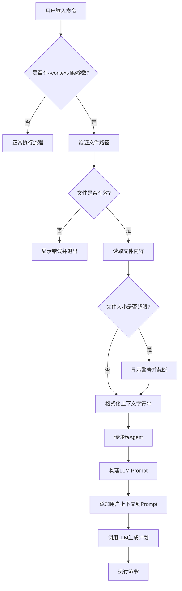

# 上下文文件功能设计文档

## 功能概述

添加一个功能，允许用户输入一个或多个文本文件作为上下文信息传递给LLM，使LLM能够了解用户的特定需求、示例、配置说明等信息。

## 使用场景

1. **示例提供**：用户可以提供命令示例文件，让LLM参考这些示例生成类似的命令
2. **说明文档**：提供项目的README或配置说明，让LLM了解项目结构和要求
3. **环境配置**：提供proxy配置、环境变量设置等特殊指令
4. **代码片段**：提供代码模板或参考代码，让LLM生成符合风格的命令
5. **规范文档**：提供命名规范、编码规范等约束条件

## 设计方案

### 1. 命令行参数设计

```bash
# 单个上下文文件
python main.py --context-file examples.txt -c "创建类似的脚本"

# 多个上下文文件
python main.py --context-file examples.txt --context-file config.md -c "配置环境"

# 简写形式
python main.py -f examples.txt -c "创建脚本"

# 结合其他模式使用
python main.py --adaptive --context-file proxy.txt -c "配置代理并测试连接"
python main.py --ssh-host user@host --context-file deploy.md -c "部署应用"
```

### 2. 文件格式支持

支持的文件类型：
- `.txt` - 纯文本文件
- `.md` - Markdown文档
- `.json` - JSON配置文件
- `.yaml` / `.yml` - YAML配置文件
- `.sh` / `.bash` - Shell脚本
- `.py` - Python脚本
- `.conf` / `.cfg` - 配置文件
- 其他纯文本格式

### 3. 模块设计

#### 3.1 新增模块：`autoshell/context_file.py`

```python
class ContextFileManager:
    """管理用户提供的上下文文件"""
    
    @staticmethod
    def read_context_file(filepath: str) -> dict:
        """
        读取单个上下文文件
        返回: {
            'filepath': str,
            'filename': str,
            'content': str,
            'size': int,
            'error': str or None
        }
        """
    
    @staticmethod
    def read_multiple_files(filepaths: list) -> list:
        """读取多个上下文文件"""
    
    @staticmethod
    def validate_file(filepath: str) -> tuple:
        """
        验证文件是否存在、可读、大小合理
        返回: (is_valid: bool, error_message: str)
        """
    
    @staticmethod
    def format_context_string(context_files: list) -> str:
        """
        将上下文文件格式化为prompt字符串
        返回格式化的字符串，用于添加到LLM prompt中
        """
```

#### 3.2 修改现有模块

**`main.py`**：
- 添加 `--context-file` / `-f` 参数
- 读取并验证上下文文件
- 将文件内容传递给Agent

**`autoshell/agent.py`**：
- 在 `__init__` 中接收 `context_files` 参数
- 在 `run()` 和 `run_adaptive()` 方法中使用上下文文件
- 将上下文文件内容传递给LLM

**`autoshell/llm.py`**：
- 修改 `generate_plan()` 方法，接收 `user_context` 参数
- 在system prompt中添加用户上下文部分

**`autoshell/config.py`**：
- 添加上下文文件相关配置
  - `MAX_CONTEXT_FILE_SIZE`: 单个文件最大大小（默认1MB）
  - `MAX_CONTEXT_FILES`: 最多支持的文件数量（默认5个）

### 4. Prompt设计

在LLM的system prompt中添加用户上下文部分：

```
Current Execution Environment:
{context_str}

User Provided Context:
The user has provided the following context files for reference:

--- File: examples.txt ---
{file_content_1}
--- End of examples.txt ---

--- File: config.md ---
{file_content_2}
--- End of config.md ---

Please consider the information in these context files when generating commands.
The context may include:
- Examples to follow
- Configuration requirements
- Environment setup instructions
- Coding standards or conventions
- Project-specific information
```

### 5. 错误处理

需要处理的错误情况：
1. **文件不存在**：提示用户文件路径错误
2. **文件不可读**：提示权限问题
3. **文件过大**：限制单个文件大小（如1MB），避免token超限
4. **文件数量过多**：限制最多文件数量（如5个）
5. **编码错误**：尝试多种编码方式读取（UTF-8, GBK等）
6. **二进制文件**：检测并拒绝二进制文件

### 6. 安全考虑

1. **路径验证**：
   - 检查文件路径是否合法
   - 防止路径遍历攻击（如 `../../etc/passwd`）
   - 可选：限制只能读取特定目录下的文件

2. **文件大小限制**：
   - 防止读取过大文件导致内存问题
   - 防止token超限导致API调用失败

3. **敏感信息提示**：
   - 在读取文件前提示用户注意敏感信息
   - 建议用户不要包含密码、密钥等敏感数据

### 7. 用户体验优化

1. **文件预览**：
   - 在执行前显示将要读取的文件列表
   - 显示每个文件的大小和前几行内容

2. **进度提示**：
   - 读取多个文件时显示进度
   - 使用rich库的状态显示

3. **错误提示**：
   - 清晰的错误信息
   - 提供解决建议

4. **文档说明**：
   - 在README中添加使用示例
   - 创建独立的功能文档

## 实现流程图



## 配置示例

`.env` 文件新增配置：

```bash
# 上下文文件配置
MAX_CONTEXT_FILE_SIZE=1048576    # 1MB
MAX_CONTEXT_FILES=5              # 最多5个文件
CONTEXT_FILE_ENCODING=utf-8      # 默认编码
```

## 使用示例

### 示例1：使用示例文件

创建 `examples.txt`：
```
# 示例：创建Python虚拟环境
python -m venv venv
source venv/bin/activate  # Linux/Mac
venv\Scripts\activate     # Windows
pip install -r requirements.txt
```

使用：
```bash
python main.py -f examples.txt -c "为我的项目创建虚拟环境并安装依赖"
```

### 示例2：使用配置说明

创建 `proxy-config.md`：
```markdown
# 代理配置说明

我们公司使用以下代理服务器：
- HTTP代理: http://proxy.company.com:8080
- HTTPS代理: https://proxy.company.com:8080
- 不使用代理的地址: localhost,127.0.0.1,.company.com

需要设置以下环境变量：
- http_proxy
- https_proxy
- no_proxy
```

使用：
```bash
python main.py -f proxy-config.md -c "配置系统代理"
```

### 示例3：多个上下文文件

```bash
python main.py \
  -f project-structure.md \
  -f coding-standards.txt \
  -f deployment-guide.md \
  -c "创建一个新的微服务模块"
```

### 示例4：结合SSH模式

```bash
python main.py \
  --ssh-host user@server \
  -f server-config.txt \
  -c "根据配置文件设置服务器环境"
```

### 示例5：结合自适应模式

```bash
python main.py \
  --adaptive \
  -f test-requirements.md \
  -c "检查系统是否满足测试要求，如果不满足则安装缺失的组件"
```

## 测试计划

### 单元测试
1. 测试文件读取功能
2. 测试文件验证功能
3. 测试格式化功能
4. 测试错误处理

### 集成测试
1. 测试单个文件场景
2. 测试多个文件场景
3. 测试与SSH模式结合
4. 测试与自适应模式结合
5. 测试各种文件格式

### 边界测试
1. 测试空文件
2. 测试超大文件
3. 测试不存在的文件
4. 测试无权限的文件
5. 测试特殊字符文件名

## 文档更新

需要更新的文档：
1. `README.md` - 添加功能说明和使用示例
2. 创建 `CONTEXT_FILE_USAGE.md` - 详细使用指南
3. `.env.example` - 添加新的配置项
4. `main.py --help` - 更新帮助信息

## 实现优先级

### P0 - 核心功能（必须实现）
- [x] 命令行参数解析
- [x] 单个文件读取
- [x] 文件验证（存在性、可读性）
- [x] 基本错误处理
- [x] 集成到LLM prompt

### P1 - 重要功能（应该实现）
- [x] 多个文件支持
- [x] 文件大小限制
- [x] 编码处理
- [x] 格式化输出
- [x] 用户提示信息

### P2 - 增强功能（可以实现）
- [ ] 文件内容预览
- [ ] 智能文件类型检测
- [ ] 上下文文件缓存
- [ ] 支持URL读取（从网络读取文件）
- [ ] 支持通配符（如 `*.md`）

## 潜在扩展

1. **上下文模板**：预定义常用的上下文模板
2. **上下文配置文件**：支持 `.autoshell-context` 配置文件
3. **交互式选择**：在交互模式下动态添加/移除上下文文件
4. **上下文历史**：记住最近使用的上下文文件
5. **智能推荐**：根据任务类型推荐相关上下文文件

## 总结

这个功能将大大增强AutoShell的灵活性和实用性，使用户能够：
- 提供更精确的上下文信息
- 复用已有的文档和配置
- 让LLM生成更符合特定需求的命令
- 减少重复输入相同的说明

实现难度：**中等**
预计开发时间：**2-3小时**
用户价值：**高**
