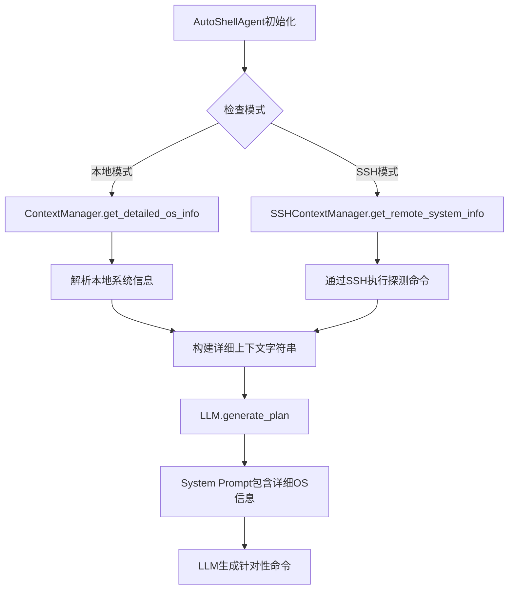

# OS信息增强设计方案

## 概述

本设计旨在增强AutoShell在SSH模式和本地Linux模式下的系统信息收集能力，将详细的OS类型、版本、发行版等信息加入到LLM的prompt中，使LLM能够更好地理解目标环境并生成更准确的命令。

## 当前状态分析

### 现有信息收集机制

当前 [`ContextManager`](autoshell/context.py) 收集的信息：
- **OS类型**：通过 `platform.system()` 获取（Windows/Linux/Darwin）
- **Shell类型**：通过环境变量推断（bash/zsh/cmd/powershell等）
- **当前工作目录**：通过 `os.getcwd()` 获取
- **当前用户**：通过 `getpass.getuser()` 获取

### 现有Prompt构建流程

在 [`llm.py`](autoshell/llm.py) 的 [`generate_plan()`](autoshell/llm.py:99) 方法中：
1. 调用 `ContextManager.get_context_string()` 获取格式化的上下文信息
2. 将上下文信息嵌入到system prompt中
3. LLM基于这些信息生成命令计划

### 问题识别

1. **信息不够详细**：仅知道"Linux"不足以生成最优命令
   - 不同发行版的包管理器不同（apt/yum/dnf/pacman等）
   - 不同版本的命令参数可能不同
   - 系统架构影响软件包选择

2. **SSH模式缺少远程信息**：当前SSH模式下没有收集远程服务器的详细信息

3. **本地Linux信息不完整**：本地Linux模式下也缺少发行版、版本等详细信息

## 设计方案

### 1. 需要收集的详细信息

#### 对于Linux系统（本地或远程）
- **发行版名称**：Ubuntu/CentOS/Debian/Fedora/Arch等
- **发行版版本**：20.04/22.04/7/8等
- **内核版本**：5.15.0-xxx
- **系统架构**：x86_64/aarch64/armv7l等
- **包管理器**：apt/yum/dnf/pacman等
- **Python版本**：3.8/3.9/3.10等（如果需要）
- **是否有sudo权限**：影响命令生成策略

#### 对于Windows系统（本地）
- **Windows版本**：Windows 10/11/Server 2019等
- **版本号**：Build号
- **系统架构**：x64/x86/ARM64
- **PowerShell版本**

#### 对于macOS系统（本地）
- **macOS版本**：Monterey/Ventura/Sonoma等
- **版本号**：12.x/13.x/14.x
- **系统架构**：x86_64/arm64

### 2. 信息收集策略

#### 2.1 本地模式信息收集

```python
# 在 ContextManager 中添加新方法
@staticmethod
def get_detailed_os_info() -> dict:
    """获取详细的操作系统信息"""
    os_type = platform.system()
    info = {
        "os_type": os_type,
        "architecture": platform.machine(),
        "python_version": platform.python_version()
    }
    
    if os_type == "Linux":
        # 读取 /etc/os-release 获取发行版信息
        info.update(_get_linux_distro_info())
        # 获取内核版本
        info["kernel"] = platform.release()
        # 检测包管理器
        info["package_manager"] = _detect_package_manager()
        
    elif os_type == "Windows":
        info["windows_version"] = platform.version()
        info["windows_release"] = platform.release()
        # 检测PowerShell版本
        info["powershell_version"] = _get_powershell_version()
        
    elif os_type == "Darwin":
        info["macos_version"] = platform.mac_ver()[0]
        info["macos_release"] = _get_macos_release_name()
    
    return info
```

#### 2.2 SSH模式信息收集

在SSH连接建立后，执行一系列命令收集远程服务器信息：

```python
# 在 CommandExecutor 或新的 SSHContextManager 中实现
@classmethod
def get_remote_system_info(cls, ssh_config: dict) -> dict:
    """通过SSH收集远程系统信息"""
    commands = {
        "os_type": "uname -s",
        "kernel": "uname -r",
        "architecture": "uname -m",
        "distro": "cat /etc/os-release 2>/dev/null || cat /etc/redhat-release 2>/dev/null || echo 'Unknown'",
        "python_version": "python3 --version 2>&1 || python --version 2>&1 || echo 'Not installed'",
        "shell": "echo $SHELL",
        "user": "whoami",
        "home": "echo $HOME",
        "has_sudo": "sudo -n true 2>/dev/null && echo 'yes' || echo 'no'"
    }
    
    # 执行命令并解析结果
    # ...
```

### 3. 架构设计



### 4. 实现细节

#### 4.1 扩展ContextManager

在 [`autoshell/context.py`](autoshell/context.py) 中添加：

```python
class ContextManager:
    # 现有方法保持不变...
    
    @staticmethod
    def get_detailed_os_info() -> dict:
        """获取详细的操作系统信息（本地）"""
        # 实现详细信息收集
        pass
    
    @staticmethod
    def _get_linux_distro_info() -> dict:
        """解析Linux发行版信息"""
        # 读取 /etc/os-release
        pass
    
    @staticmethod
    def _detect_package_manager() -> str:
        """检测Linux包管理器"""
        # 检查 apt/yum/dnf/pacman 等命令是否存在
        pass
    
    @classmethod
    def get_enhanced_context_string(cls, ssh_config=None) -> str:
        """获取增强的上下文字符串"""
        if ssh_config:
            # SSH模式：收集远程信息
            remote_info = cls.get_remote_system_info(ssh_config)
            return cls._format_remote_context(remote_info)
        else:
            # 本地模式：收集本地信息
            local_info = cls.get_detailed_os_info()
            return cls._format_local_context(local_info)
```

#### 4.2 创建SSHContextManager

创建新文件 `autoshell/ssh_context.py`：

```python
class SSHContextManager:
    """SSH模式下的远程系统信息收集"""
    
    @staticmethod
    def get_remote_system_info(ssh_config: dict) -> dict:
        """收集远程系统详细信息"""
        # 建立SSH连接
        # 执行探测命令
        # 解析结果
        pass
    
    @staticmethod
    def _parse_os_release(content: str) -> dict:
        """解析 /etc/os-release 内容"""
        pass
    
    @staticmethod
    def _detect_remote_package_manager(ssh_client) -> str:
        """检测远程包管理器"""
        pass
```

#### 4.3 修改Agent初始化流程

在 [`autoshell/agent.py`](autoshell/agent.py) 的 [`__init__`](autoshell/agent.py:16) 方法中：

```python
def __init__(self, ssh_config=None):
    self.llm = LLMClient()
    self.max_retries = Config.MAX_RETRIES
    self.ssh_config = ssh_config
    
    # 新增：初始化时收集系统信息
    if ssh_config:
        # SSH模式：收集远程信息（延迟到第一次使用时）
        self._remote_info = None
    else:
        # 本地模式：立即收集本地信息
        self._local_info = ContextManager.get_detailed_os_info()
```

#### 4.4 更新LLM Prompt

在 [`autoshell/llm.py`](autoshell/llm.py) 的 [`generate_plan()`](autoshell/llm.py:99) 方法中：

修改system prompt以包含更详细的环境信息：

```python
system_prompt = f"""
You are an expert system engineer and command-line wizard.
Your goal is to translate natural language instructions into a SERIES of precise, efficient, and safe Shell commands.

Current Execution Environment:
{context_str}

IMPORTANT: Pay special attention to the OS distribution and version information above.
- For Ubuntu/Debian systems, use apt/apt-get
- For CentOS/RHEL systems, use yum or dnf (depending on version)
- For Arch Linux, use pacman
- Adjust command syntax based on the specific OS version
- Consider the system architecture when suggesting package installations

...（其余prompt内容）
"""
```

### 5. 信息缓存策略

为避免重复收集信息（特别是SSH模式），实现缓存机制：

```python
class AutoShellAgent:
    def __init__(self, ssh_config=None):
        # ...
        self._system_info_cache = None
        self._cache_timestamp = None
        self._cache_ttl = 300  # 5分钟缓存
    
    def _get_system_info(self) -> dict:
        """获取系统信息（带缓存）"""
        now = time.time()
        if self._system_info_cache and (now - self._cache_timestamp) < self._cache_ttl:
            return self._system_info_cache
        
        # 重新收集信息
        if self.ssh_config:
            info = SSHContextManager.get_remote_system_info(self.ssh_config)
        else:
            info = ContextManager.get_detailed_os_info()
        
        self._system_info_cache = info
        self._cache_timestamp = now
        return info
```

### 6. 错误处理

信息收集过程中可能遇到的问题：

1. **SSH连接失败**：使用基本信息（仅OS类型）
2. **权限不足**：某些信息无法获取时使用默认值
3. **命令不存在**：提供降级方案
4. **超时**：设置合理的超时时间，避免阻塞

```python
def get_remote_system_info(ssh_config: dict) -> dict:
    """收集远程系统信息（带错误处理）"""
    default_info = {
        "os_type": "Linux",
        "distro": "Unknown",
        "architecture": "x86_64"
    }
    
    try:
        # 尝试收集详细信息
        # ...
    except TimeoutError:
        console.print("[yellow]Warning: System info collection timed out, using defaults[/yellow]")
        return default_info
    except Exception as e:
        console.print(f"[yellow]Warning: Failed to collect system info: {e}[/yellow]")
        return default_info
```

### 7. 输出格式示例

#### 本地Linux模式
```
Detected: Linux (Ubuntu 22.04 LTS) | bash | user@hostname
Architecture: x86_64 | Kernel: 5.15.0-91-generic
Package Manager: apt | Python: 3.10.12
```

#### SSH模式
```
Mode: SSH Remote | Target: admin@192.168.1.100:22
Remote System: Linux (CentOS 8.5) | bash | admin@server
Architecture: x86_64 | Kernel: 4.18.0-348.el8.x86_64
Package Manager: dnf | Python: 3.6.8
```

#### Windows本地模式
```
Detected: Windows 11 (Build 22621) | PowerShell 7.3 | user@hostname
Architecture: AMD64 | Python: 3.11.5
```

### 8. 性能考虑

1. **本地模式**：信息收集开销小（<100ms），可在初始化时完成
2. **SSH模式**：
   - 首次连接时收集信息（约1-2秒）
   - 使用缓存避免重复收集
   - 可选：在后台异步收集，不阻塞用户输入

### 9. 配置选项

在 [`autoshell/config.py`](autoshell/config.py) 中添加：

```python
class Config:
    # 现有配置...
    
    # 新增配置
    COLLECT_DETAILED_INFO = os.getenv("COLLECT_DETAILED_INFO", "true").lower() == "true"
    SYSTEM_INFO_CACHE_TTL = int(os.getenv("SYSTEM_INFO_CACHE_TTL", "300"))  # 秒
    SSH_INFO_TIMEOUT = int(os.getenv("SSH_INFO_TIMEOUT", "10"))  # 秒
```

### 10. 测试计划

#### 单元测试
- 测试各个信息收集函数
- 测试不同Linux发行版的解析
- 测试SSH连接和信息收集
- 测试缓存机制

#### 集成测试
- 本地Linux环境测试
- SSH远程Linux环境测试
- Windows本地环境测试
- macOS本地环境测试

#### 场景测试
- 测试LLM是否能根据发行版生成正确的包管理命令
- 测试在不同架构下的命令生成
- 测试SSH模式下的信息收集和命令执行

## 实施步骤

1. **阶段1：基础架构**
   - 扩展 `ContextManager` 添加详细信息收集方法
   - 创建 `SSHContextManager` 处理远程信息收集
   - 实现信息解析和格式化函数

2. **阶段2：集成到现有流程**
   - 修改 `AutoShellAgent` 初始化流程
   - 更新 `LLM.generate_plan()` 的prompt构建
   - 实现缓存机制

3. **阶段3：错误处理和优化**
   - 添加完善的错误处理
   - 实现降级策略
   - 性能优化

4. **阶段4：测试和文档**
   - 编写单元测试
   - 进行集成测试
   - 更新用户文档

## 预期效果

1. **更准确的命令生成**：LLM能够根据具体的发行版和版本生成最合适的命令
2. **更好的用户体验**：减少因环境差异导致的命令执行失败
3. **更智能的错误处理**：LLM能够理解环境限制，提供更好的替代方案
4. **更强的适应性**：支持更多Linux发行版和系统配置

## 风险和缓解措施

| 风险 | 影响 | 缓解措施 |
|------|------|----------|
| SSH信息收集超时 | 用户体验下降 | 设置合理超时，提供降级方案 |
| 权限不足无法获取某些信息 | 信息不完整 | 使用默认值，不影响基本功能 |
| 不同发行版命令差异 | 解析失败 | 提供多种解析方法，使用正则表达式 |
| 增加初始化时间 | 启动变慢 | 使用缓存，异步收集（可选） |

## 后续优化方向

1. **智能缓存失效**：检测到环境变化时自动刷新缓存
2. **更多系统信息**：收集已安装的关键软件版本（docker/nginx/mysql等）
3. **环境指纹**：为常见环境创建预设配置
4. **多主机管理**：支持保存和切换多个SSH配置
