# AutoShell SSH 远程执行功能设计文档

## 1. 概述

本文档描述了为 AutoShell 项目添加 SSH 远程命令执行能力的架构设计。该功能允许在 Windows 客户端上运行 AutoShell，同时将命令分发到远程 Linux 服务器执行。

### 1.1 核心目标

- **执行抽象**：通过接口设计实现本地和远程执行的统一抽象
- **SSH 集成**：使用 Paramiko 库实现可靠的 SSH 连接和命令执行
- **配置扩展**：支持 SSH 连接参数的灵活配置
- **实时流式输出**：确保远程 stdout/stderr 实时传输到本地控制台
- **跨平台兼容**：处理 Windows 客户端与 Linux 服务器之间的路径和字符编码差异

## 2. 架构设计

### 2.1 执行器接口抽象

创建 `CommandExecutor` 抽象基类，定义统一的命令执行接口：

```python
# autoshell/executors/base.py
from abc import ABC, abstractmethod
from typing import Dict, Optional

class CommandExecutor(ABC):
    """命令执行器抽象基类"""
    
    @abstractmethod
    def execute(self, command: str, cwd: Optional[str] = None, 
                description: Optional[str] = None) -> Dict:
        """
        执行命令并返回结果
        
        Args:
            command: 要执行的命令
            cwd: 工作目录（可选）
            description: 步骤描述（可选）
            
        Returns:
            Dict: {
                "return_code": int,
                "stdout": str,
                "stderr": str,
                "executed": bool
            }
        """
        pass
    
    @abstractmethod
    def is_safe(self, command: str) -> bool:
        """检查命令是否安全"""
        pass
    
    @abstractmethod
    def close(self):
        """清理资源（如关闭 SSH 连接）"""
        pass
    
    @abstractmethod
    def get_context(self) -> Dict:
        """获取执行环境上下文信息"""
        pass
```

### 2.2 本地执行器实现

重构现有的 [`CommandExecutor`](autoshell/executor.py:11) 为 `LocalCommandExecutor`：

```python
# autoshell/executors/local.py
import subprocess
import shlex
import os
import platform
from rich.console import Console
from rich.prompt import Confirm
from rich.panel import Panel
from rich.syntax import Syntax
from .base import CommandExecutor

console = Console()

class LocalCommandExecutor(CommandExecutor):
    """本地命令执行器"""
    
    WHITELIST = {
        "ls", "dir", "pwd", "echo", "date", "whoami", "hostname", 
        "uname", "cd", "mkdir", "touch", "cat", "type", "cp", 
        "mv", "rm", "grep", "find", "head", "tail"
    }
    
    def __init__(self):
        self.os_type = platform.system()
    
    def is_safe(self, command: str) -> bool:
        """检查命令是否在白名单中"""
        try:
            if any(op in command for op in ["&&", "||", ";", "|"]):
                return False
            
            tokens = shlex.split(command)
            if not tokens:
                return False
            
            cmd_base = tokens[0].lower()
            return cmd_base in self.WHITELIST
        except Exception:
            return False
    
    def execute(self, command: str, cwd: str = None, 
                description: str = None) -> dict:
        """执行本地命令"""
        
        is_safe_cmd = self.is_safe(command)
        
        if not is_safe_cmd:
            if description:
                console.print(f"[bold blue]Step:[/bold blue] {description}")
            
            syntax = Syntax(command, "bash", theme="monokai", line_numbers=False)
            console.print(Panel(syntax, title="[bold red]Review Safe-Check[/bold red]", 
                              expand=False, border_style="red"))
            
            if not Confirm.ask("[bold red]Command not in whitelist. Execute?[/bold red]", 
                             default=False):
                return {
                    "return_code": -1, 
                    "stdout": "", 
                    "stderr": "User aborted execution.", 
                    "executed": False
                }
        
        try:
            if cwd and not os.path.exists(cwd):
                return {
                    "return_code": -1,
                    "stdout": "",
                    "stderr": f"Directory not found: {cwd}",
                    "executed": True
                }
            
            result = subprocess.run(
                command,
                shell=True,
                cwd=cwd,
                capture_output=True,
                text=True
            )
            
            return {
                "return_code": result.returncode,
                "stdout": result.stdout,
                "stderr": result.stderr,
                "executed": True
            }
        except Exception as e:
            return {
                "return_code": -1,
                "stdout": "",
                "stderr": str(e),
                "executed": True
            }
    
    def close(self):
        """本地执行器无需清理资源"""
        pass
    
    def get_context(self) -> dict:
        """获取本地环境上下文"""
        import getpass
        return {
            "os": self.os_type,
            "shell": self._get_shell_type(),
            "cwd": os.getcwd(),
            "user": getpass.getuser(),
            "execution_mode": "local"
        }
    
    def _get_shell_type(self) -> str:
        """获取 Shell 类型"""
        if self.os_type == "Windows":
            if "PSModulePath" in os.environ:
                return "powershell"
            return "cmd"
        else:
            shell_env = os.environ.get("SHELL")
            if shell_env:
                return os.path.basename(shell_env)
            return "bash"
```

### 2.3 SSH 执行器实现

使用 Paramiko 实现远程 SSH 执行：

```python
# autoshell/executors/ssh.py
import paramiko
import os
from typing import Optional, Dict
from rich.console import Console
from rich.prompt import Confirm
from rich.panel import Panel
from rich.syntax import Syntax
from .base import CommandExecutor

console = Console()

class SSHCommandExecutor(CommandExecutor):
    """SSH 远程命令执行器"""
    
    WHITELIST = {
        "ls", "pwd", "echo", "date", "whoami", "hostname", "uname", 
        "cd", "mkdir", "touch", "cat", "cp", "mv", "rm", "grep", 
        "find", "head", "tail", "chmod", "chown"
    }
    
    def __init__(self, host: str, port: int, username: str, 
                 password: Optional[str] = None, 
                 key_path: Optional[str] = None,
                 timeout: int = 30):
        """
        初始化 SSH 执行器
        
        Args:
            host: SSH 服务器地址
            port: SSH 端口
            username: 用户名
            password: 密码（可选）
            key_path: 私钥路径（可选）
            timeout: 连接超时时间
        """
        self.host = host
        self.port = port
        self.username = username
        self.password = password
        self.key_path = key_path
        self.timeout = timeout
        
        self.client = None
        self.sftp = None
        self._remote_cwd = None
        self._remote_os = None
        self._remote_shell = None
        
        self._connect()
        self._detect_remote_environment()
    
    def _connect(self):
        """建立 SSH 连接"""
        try:
            self.client = paramiko.SSHClient()
            self.client.set_missing_host_key_policy(paramiko.AutoAddPolicy())
            
            connect_kwargs = {
                "hostname": self.host,
                "port": self.port,
                "username": self.username,
                "timeout": self.timeout
            }
            
            # 优先使用密钥认证
            if self.key_path and os.path.exists(self.key_path):
                try:
                    private_key = paramiko.RSAKey.from_private_key_file(self.key_path)
                    connect_kwargs["pkey"] = private_key
                    console.print(f"[green]Using SSH key authentication: {self.key_path}[/green]")
                except Exception as e:
                    console.print(f"[yellow]Failed to load SSH key: {e}[/yellow]")
                    if self.password:
                        connect_kwargs["password"] = self.password
            elif self.password:
                connect_kwargs["password"] = self.password
            else:
                raise ValueError("Either password or key_path must be provided")
            
            self.client.connect(**connect_kwargs)
            self.sftp = self.client.open_sftp()
            
            console.print(f"[bold green]SSH connected to {self.username}@{self.host}:{self.port}[/bold green]")
            
        except Exception as e:
            raise ConnectionError(f"Failed to connect to SSH server: {str(e)}")
    
    def _detect_remote_environment(self):
        """检测远程环境信息"""
        try:
            # 检测操作系统
            _, stdout, _ = self.client.exec_command("uname -s")
            self._remote_os = stdout.read().decode().strip()
            
            # 检测 Shell 类型
            _, stdout, _ = self.client.exec_command("echo $SHELL")
            shell_path = stdout.read().decode().strip()
            self._remote_shell = os.path.basename(shell_path) if shell_path else "bash"
            
            # 获取初始工作目录
            _, stdout, _ = self.client.exec_command("pwd")
            self._remote_cwd = stdout.read().decode().strip()
            
            console.print(f"[dim]Remote: {self._remote_os} | {self._remote_shell} | {self._remote_cwd}[/dim]")
            
        except Exception as e:
            console.print(f"[yellow]Warning: Could not detect remote environment: {e}[/yellow]")
            self._remote_os = "Linux"
            self._remote_shell = "bash"
            self._remote_cwd = "/home/" + self.username
    
    def is_safe(self, command: str) -> bool:
        """检查命令是否在白名单中"""
        try:
            if any(op in command for op in ["&&", "||", ";", "|"]):
                return False
            
            # 使用 shlex 解析（POSIX 模式用于 Linux）
            import shlex
            tokens = shlex.split(command, posix=True)
            if not tokens:
                return False
            
            cmd_base = tokens[0].lower()
            return cmd_base in self.WHITELIST
        except Exception:
            return False
    
    def execute(self, command: str, cwd: Optional[str] = None, 
                description: Optional[str] = None) -> Dict:
        """
        执行远程命令
        
        Args:
            command: 要执行的命令
            cwd: 远程工作目录（可选）
            description: 步骤描述（可选）
            
        Returns:
            执行结果字典
        """
        
        if not self.client or not self.client.get_transport() or not self.client.get_transport().is_active():
            console.print("[yellow]SSH connection lost. Reconnecting...[/yellow]")
            self._connect()
        
        is_safe_cmd = self.is_safe(command)
        
        if not is_safe_cmd:
            if description:
                console.print(f"[bold blue]Step:[/bold blue] {description}")
            
            syntax = Syntax(command, "bash", theme="monokai", line_numbers=False)
            console.print(Panel(syntax, title="[bold red]Review Safe-Check (Remote)[/bold red]", 
                              expand=False, border_style="red"))
            
            if not Confirm.ask("[bold red]Command not in whitelist. Execute on remote server?[/bold red]", 
                             default=False):
                return {
                    "return_code": -1,
                    "stdout": "",
                    "stderr": "User aborted execution.",
                    "executed": False
                }
        
        try:
            # 构建完整命令（包含 cd 到指定目录）
            full_command = command
            if cwd:
                # 验证远程目录是否存在
                check_cmd = f"test -d {cwd} && echo 'exists'"
                _, stdout, _ = self.client.exec_command(check_cmd)
                if stdout.read().decode().strip() != "exists":
                    return {
                        "return_code": -1,
                        "stdout": "",
                        "stderr": f"Remote directory not found: {cwd}",
                        "executed": True
                    }
                full_command = f"cd {cwd} && {command}"
            
            # 执行命令并实时捕获输出
            stdin, stdout, stderr = self.client.exec_command(full_command, get_pty=True)
            
            # 读取输出
            stdout_data = stdout.read().decode('utf-8', errors='replace')
            stderr_data = stderr.read().decode('utf-8', errors='replace')
            exit_code = stdout.channel.recv_exit_status()
            
            # 清理 PTY 控制字符（如果需要）
            stdout_data = self._clean_terminal_output(stdout_data)
            stderr_data = self._clean_terminal_output(stderr_data)
            
            return {
                "return_code": exit_code,
                "stdout": stdout_data,
                "stderr": stderr_data,
                "executed": True
            }
            
        except Exception as e:
            return {
                "return_code": -1,
                "stdout": "",
                "stderr": f"SSH execution error: {str(e)}",
                "executed": True
            }
    
    def _clean_terminal_output(self, output: str) -> str:
        """
        清理终端控制字符
        
        移除 ANSI 转义序列和其他控制字符，确保在 Windows 控制台正确显示
        """
        import re
        # 移除 ANSI 转义序列
        ansi_escape = re.compile(r'\x1B(?:[@-Z\\-_]|\[[0-?]*[ -/]*[@-~])')
        cleaned = ansi_escape.sub('', output)
        return cleaned
    
    def close(self):
        """关闭 SSH 连接"""
        try:
            if self.sftp:
                self.sftp.close()
            if self.client:
                self.client.close()
            console.print("[dim]SSH connection closed.[/dim]")
        except Exception as e:
            console.print(f"[yellow]Error closing SSH connection: {e}[/yellow]")
    
    def get_context(self) -> Dict:
        """获取远程环境上下文"""
        return {
            "os": self._remote_os or "Linux",
            "shell": self._remote_shell or "bash",
            "cwd": self._remote_cwd or f"/home/{self.username}",
            "user": self.username,
            "execution_mode": "ssh",
            "remote_host": f"{self.username}@{self.host}:{self.port}"
        }
    
    def update_cwd(self, new_cwd: str):
        """更新远程工作目录"""
        self._remote_cwd = new_cwd
```

### 2.4 配置扩展

扩展 [`Config`](autoshell/config.py:7) 类以支持 SSH 配置：

```python
# autoshell/config.py
import os
from dotenv import load_dotenv

load_dotenv()

class Config:
    # LLM 配置
    OPENAI_API_KEY = os.getenv("OPENAI_API_KEY")
    OPENAI_BASE_URL = os.getenv("OPENAI_BASE_URL", "https://api.openai.com/v1")
    LLM_MODEL = os.getenv("LLM_MODEL", "gpt-3.5-turbo")
    MAX_RETRIES = int(os.getenv("MAX_RETRIES", "3"))
    
    # 执行模式配置
    EXECUTION_MODE = os.getenv("EXECUTION_MODE", "local")  # "local" 或 "ssh"
    
    # SSH 配置
    SSH_HOST = os.getenv("SSH_HOST")
    SSH_PORT = int(os.getenv("SSH_PORT", "22"))
    SSH_USERNAME = os.getenv("SSH_USERNAME")
    SSH_PASSWORD = os.getenv("SSH_PASSWORD")
    SSH_KEY_PATH = os.getenv("SSH_KEY_PATH")
    SSH_TIMEOUT = int(os.getenv("SSH_TIMEOUT", "30"))
    
    @staticmethod
    def validate():
        """验证必需的配置项"""
        if not Config.OPENAI_API_KEY:
            raise ValueError("OPENAI_API_KEY is not set. Please set it in .env file.")
        
        if Config.EXECUTION_MODE == "ssh":
            if not Config.SSH_HOST:
                raise ValueError("SSH_HOST is required when EXECUTION_MODE=ssh")
            if not Config.SSH_USERNAME:
                raise ValueError("SSH_USERNAME is required when EXECUTION_MODE=ssh")
            if not Config.SSH_PASSWORD and not Config.SSH_KEY_PATH:
                raise ValueError("Either SSH_PASSWORD or SSH_KEY_PATH must be set for SSH mode")
    
    @staticmethod
    def is_ssh_mode() -> bool:
        """检查是否为 SSH 模式"""
        return Config.EXECUTION_MODE.lower() == "ssh"
```

### 2.5 Agent 集成

修改 [`AutoShellAgent`](autoshell/agent.py:15) 以支持执行器选择：

```python
# autoshell/agent.py (关键修改部分)
from .config import Config
from .executors.local import LocalCommandExecutor
from .executors.ssh import SSHCommandExecutor

class AutoShellAgent:
    def __init__(self):
        self.llm = LLMClient()
        self.max_retries = Config.MAX_RETRIES
        
        # 根据配置选择执行器
        if Config.is_ssh_mode():
            self.executor = SSHCommandExecutor(
                host=Config.SSH_HOST,
                port=Config.SSH_PORT,
                username=Config.SSH_USERNAME,
                password=Config.SSH_PASSWORD,
                key_path=Config.SSH_KEY_PATH,
                timeout=Config.SSH_TIMEOUT
            )
        else:
            self.executor = LocalCommandExecutor()
        
        # 获取执行环境上下文
        self.execution_context = self.executor.get_context()
    
    def __del__(self):
        """清理资源"""
        if hasattr(self, 'executor'):
            self.executor.close()
    
    def run(self, user_query: str):
        """执行用户请求"""
        # 使用执行器的上下文信息
        context_str = self._build_context_string()
        
        # 初始化会话工作目录
        session_cwd = self.execution_context.get("cwd")
        
        # ... 其余逻辑保持不变，但使用 self.executor.execute() ...
    
    def _build_context_string(self) -> str:
        """构建上下文字符串"""
        ctx = self.execution_context
        context_parts = [
            f"- OS: {ctx['os']}",
            f"- Shell: {ctx['shell']}",
            f"- Current Working Directory: {ctx['cwd']}",
            f"- User: {ctx['user']}",
            f"- Execution Mode: {ctx['execution_mode']}"
        ]
        
        if ctx['execution_mode'] == 'ssh':
            context_parts.append(f"- Remote Host: {ctx['remote_host']}")
        
        return "\n".join(context_parts)
```

## 3. 跨平台处理

### 3.1 路径处理

- **Windows 客户端**：使用 `os.path` 和 `pathlib` 处理本地路径
- **Linux 服务器**：SSH 执行器内部使用 POSIX 路径规范
- **路径转换**：在需要时进行路径格式转换（如文件传输场景）

### 3.2 终端控制字符

SSH 执行器的 `_clean_terminal_output()` 方法负责：
- 移除 ANSI 转义序列
- 处理 PTY 特殊字符
- 确保输出在 Windows 控制台正确显示

### 3.3 字符编码

- 统一使用 UTF-8 编码
- 在解码时使用 `errors='replace'` 处理无效字符

## 4. 实时流式输出

当前实现使用 `exec_command()` 的阻塞读取。对于需要实时流式输出的场景，可以扩展为：

```python
def execute_streaming(self, command: str, cwd: Optional[str] = None):
    """实时流式执行命令"""
    stdin, stdout, stderr = self.client.exec_command(full_command, get_pty=True)
    
    # 实时读取输出
    while not stdout.channel.exit_status_ready():
        if stdout.channel.recv_ready():
            data = stdout.channel.recv(1024).decode('utf-8', errors='replace')
            console.print(data, end='')
    
    # 读取剩余输出
    remaining = stdout.read().decode('utf-8', errors='replace')
    console.print(remaining, end='')
    
    exit_code = stdout.channel.recv_exit_status()
    return exit_code
```

## 5. 安全考虑

### 5.1 认证方式

- **优先级**：SSH 密钥 > 密码
- **密钥管理**：支持标准 SSH 密钥路径（`~/.ssh/id_rsa`）
- **密码存储**：通过环境变量，不硬编码

### 5.2 命令白名单

- 本地和远程执行器各自维护白名单
- 远程白名单更严格（排除 Windows 特定命令）
- 非白名单命令需要用户确认

### 5.3 连接管理

- 自动重连机制
- 连接超时设置
- 资源清理（`__del__` 和 `close()`）

## 6. 配置示例

更新后的 `.env.example`：

```bash
# LLM Configuration
OPENAI_API_KEY=sk-xxxxxxxxxxxxxxxxxxxxxxxxxxxxxxxx
OPENAI_BASE_URL=https://api.openai.com/v1
LLM_MODEL=gpt-3.5-turbo
MAX_RETRIES=3

# Execution Mode: "local" or "ssh"
EXECUTION_MODE=local

# SSH Configuration (required when EXECUTION_MODE=ssh)
SSH_HOST=192.168.1.100
SSH_PORT=22
SSH_USERNAME=your_username
# Use either password or key-based authentication
SSH_PASSWORD=your_password
# SSH_KEY_PATH=C:/Users/YourName/.ssh/id_rsa
SSH_TIMEOUT=30
```

## 7. 目录结构更新

```
AutoShell/
├── .env.example
├── requirements.txt
├── main.py
├── autoshell/
│   ├── __init__.py
│   ├── config.py          # 扩展 SSH 配置
│   ├── context.py         # 保持不变
│   ├── llm.py            # 保持不变
│   ├── agent.py          # 集成执行器选择
│   └── executors/        # 新增：执行器模块
│       ├── __init__.py
│       ├── base.py       # 抽象基类
│       ├── local.py      # 本地执行器
│       └── ssh.py        # SSH 执行器
└── plans/
    ├── architecture.md
    └── ssh-remote-execution-design.md
```

## 8. 依赖更新

在 `requirements.txt` 中添加：

```
paramiko>=3.0.0
```

## 9. 使用流程

### 9.1 本地模式（默认）

```bash
# .env
EXECUTION_MODE=local

# 运行
python main.py
```

### 9.2 SSH 远程模式

```bash
# .env
EXECUTION_MODE=ssh
SSH_HOST=192.168.1.100
SSH_USERNAME=admin
SSH_KEY_PATH=C:/Users/YourName/.ssh/id_rsa

# 运行
python main.py
```

AutoShell 会自动：
1. 建立 SSH 连接
2. 检测远程环境（OS、Shell、CWD）
3. 将所有命令发送到远程服务器执行
4. 实时显示远程输出
5. 维护远程会话状态（如 `cd` 命令）

## 10. 测试场景

### 10.1 基本连接测试

```
AutoShell > show me the current directory and list files
```

预期：显示远程服务器的当前目录和文件列表

### 10.2 跨目录操作

```
AutoShell > create a new directory called test_project, navigate into it, and create a file named readme.txt
```

预期：在远程服务器上创建目录、切换目录、创建文件

### 10.3 错误处理

```
AutoShell > navigate to /nonexistent/path
```

预期：显示目录不存在错误，触发 LLM 自愈机制

## 11. 后续优化方向

1. **连接池**：支持多个 SSH 连接的复用
2. **文件传输**：集成 SFTP 文件上传/下载功能
3. **会话持久化**：保存 SSH 会话状态，支持断线重连
4. **多服务器支持**：同时管理多个远程服务器
5. **性能监控**：记录命令执行时间和网络延迟
6. **日志审计**：记录所有远程命令执行历史

## 12. 架构图

```mermaid
graph TB
    A[用户输入] --> B[AutoShellAgent]
    B --> C{执行模式?}
    C -->|local| D[LocalCommandExecutor]
    C -->|ssh| E[SSHCommandExecutor]
    
    D --> F[subprocess.run]
    E --> G[Paramiko SSH Client]
    
    F --> H[本地 Shell]
    G --> I[远程 Linux Server]
    
    H --> J[返回结果]
    I --> J
    
    J --> K[Rich Console 显示]
    
    B --> L[LLMClient]
    L --> M[OpenAI API]
    M --> N[生成命令计划]
    N --> B
    
    style E fill:#f9f,stroke:#333,stroke-width:2px
    style G fill:#bbf,stroke:#333,stroke-width:2px
    style I fill:#bfb,stroke:#333,stroke-width:2px
```



## 13. 关键实现要点

### 13.1 会话状态管理

SSH 执行器需要维护远程会话的工作目录状态：

```python
# 在 Agent 中处理 cd 命令
if tokens and tokens[0] == "cd":
    target_dir = tokens[1] if len(tokens) > 1 else "~"
    
    if isinstance(self.executor, SSHCommandExecutor):
        # SSH 模式：使用 POSIX 路径
        if target_dir == "~":
            target_dir = f"/home/{self.executor.username}"
        
        # 计算绝对路径（远程）
        if not target_dir.startswith('/'):
            new_cwd = f"{session_cwd}/{target_dir}"
        else:
            new_cwd = target_dir
    else:
        # 本地模式：使用 os.path
        if target_dir == "~":
            target_dir = os.path.expanduser("~")
        new_cwd = os.path.abspath(os.path.join(session_cwd, target_dir))
    
    # 验证并更新
    # ...
```

### 13.2 错误传播

确保远程执行的退出码正确传播：

```python
exit_code = stdout.channel.recv_exit_status()
```

### 13.3 PTY 模式

使用 `get_pty=True` 确保交互式命令正常工作，但需要清理控制字符。

## 14. 总结

本设计通过以下方式实现了 SSH 远程执行功能：

1. **接口抽象**：`CommandExecutor` 基类统一本地和远程执行接口
2. **模块化设计**：独立的执行器模块，易于扩展和测试
3. **配置驱动**：通过环境变量灵活切换执行模式
4. **跨平台兼容**：处理 Windows/Linux 路径和字符编码差异
5. **安全可靠**：支持密钥认证、命令白名单、自动重连

该架构保持了 AutoShell 原有的智能规划和自愈能力，同时无缝扩展到远程执行场景。
